# clase-09-proyecto-mitad-semestre

## intsrucciones

* hacer login en GitHub.com
* entrar a este repositorio disponible en [https://github.com/aud5i022-2022-1/clase-09-proyecto-mitad-semestre](https://github.com/aud5i022-2022-1/clase-09-proyecto-mitad-semestre)
* hacer click en el botón "Fork" de este repositorio para copiarlo a tu cuenta personal.
* enviar el enlace de tu repositorio y la lista de integrantes a través de u-cursos al instructor.
* ahora puedes editar este archivo siguiendo este enlace [README.md](README.md) y haciendo click en el ícono de lápiz para editar.
* recomendación: grabar tus avances seguido, para que no pierdas tu avance, para esto, baja al final de la sección de edición, elige la opción " Commit directly to the main branch." luego haz click en el botón verde "Commit changes". repite esto cada vez que quieras grabar cambios.
* para subir imágenes, haz click en este enlace a la carpeta [imagenes/](imagenes/), luego haz click en el botón "Add files" y selecciona "Upload files". arrastra tus imágenes o añadelas con el enlace "choose your files". luego elige la opción "Commit directly to the main branch" y haz click en el botón verde "Commit changes"

## contenidos de este repositorio

* carpeta [codigo_arduino/](codigo_arduino/): carpeta que contiene el codigo de Arduino
  * archivo [odigo_arduino/codigo_arduino.ino](codigo_arduino/codigo_arduino.ino) : Codigo contiene comentarios en su interior
* carpeta [imagenes/](imagenes/): Imágenes del proyecto.
* archivo [README.md](README.md)
* archivo [README.pdf](README.pdf)

## acerca de

este proyecto de mitad de semestre fue hecho en el día martes 10 de mayo 2022, como parte del curso  aud5i022-2022-1.

los integrantes son: Tania Fuentes
                     Freddy Briones

## lista de materiales

los materiales son:

* Arduino Uno
* 2 Protoboard o 1 Protoboard larga
* Muchos cables
* Potenciómetro
* 8 Luces led
* 8 Botones
* Muchas Resistencias
* Parlante pequeño

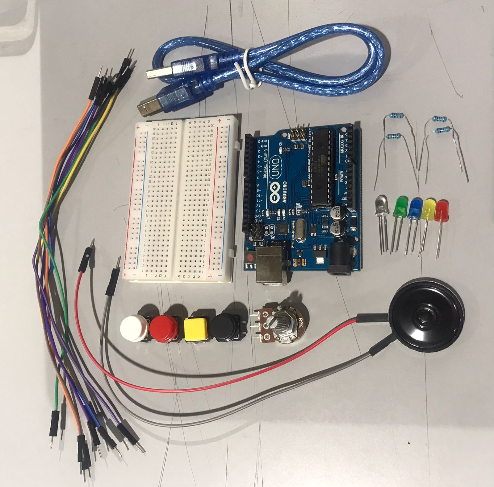

## código para microcontrolador Arduino

Este código pertenece a nuestro proyecto de mitad de semestre, que consiste en un mini teclado, controlado por Arduino, compuesto de 8 notas (octava sin sostenidos o escala de Do), combinada con luces Led. La idea del proyecto es generar la combinación de notas con las luces, es decir, cuando se presionan los botones, se prende la luz correspondiente al color del botón de la nota presionada.
El código está basado en uno entregado por le Profesor Aaron Montoya en la clase n°7 y fue modificado según los requerimientos de nuestro proyecto. 
Ese cógido lo podemos encontrar en el repositorio aud5i022-2022-1 del profesor, buscando en las clases/clase-07/ej_02_sonido_pulsador.
[Codigo de Ayuda](https://github.com/montoyamoraga/aud5i022-2022-1/blob/main/clases/clase-07/ej_02_sonido_pulsador/ej_02_sonido_pulsador.ino)

En primer lugar, en setup() hacemos que los pines del 2 al 9 sean entradas digitales, el pin 10 sea salida digital, y abrimos la comunicación serial, con el fin de que al presionar un botón suene una nota, según la frecuencia correspondiente de cada una de ellas. 
Los pines 0 y 1 corresponden a Rx y Tx respectivamente, por lo que no pueden ser utilizados como entrada, ya que interrumpen la señal y son leídos de distinta manera. 

Luego en loop() leemos las entradas (pines2-9) y usamos la salida (pin10) para enviar la señal al parlante y que al presionar los botones suenen las notas a su frecuencia correspondiente.

## Armado de circuito

Instrucciones de armado 

* 1er paso

Colocar los botones de manera equidistantes en ambas protoboard.

* 2do paso

Unir las protoboard, recordar conectar el canal negativo y positivo entre las protoboard mediante un cable para cada canal.

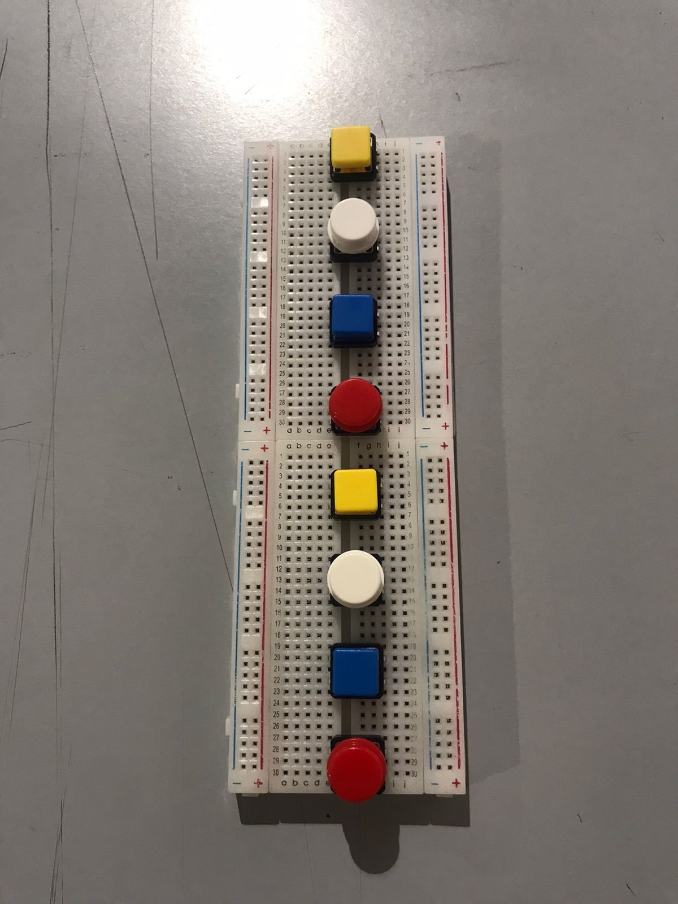

* 3er paso

Colocar una resistencia entre el canal negativo del botón y el canal negativo del circuito.

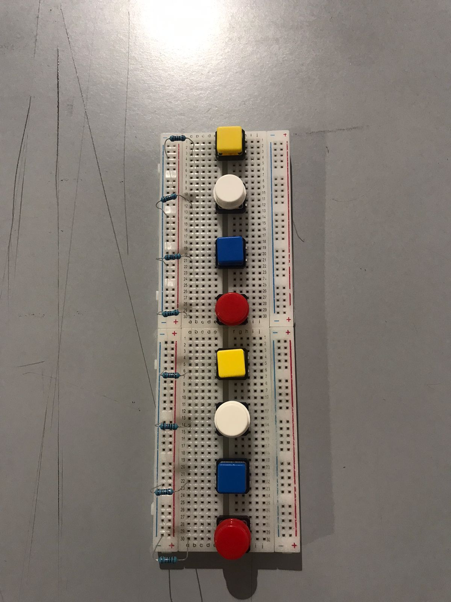

* 4to paso 

Conectar el canal positivo del circuito con el canal positivo del botón.

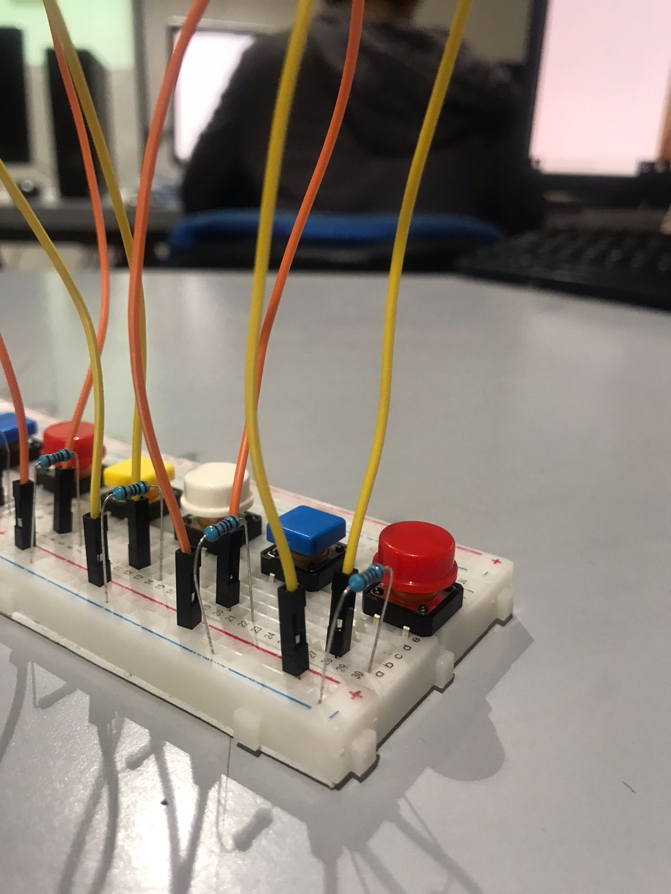
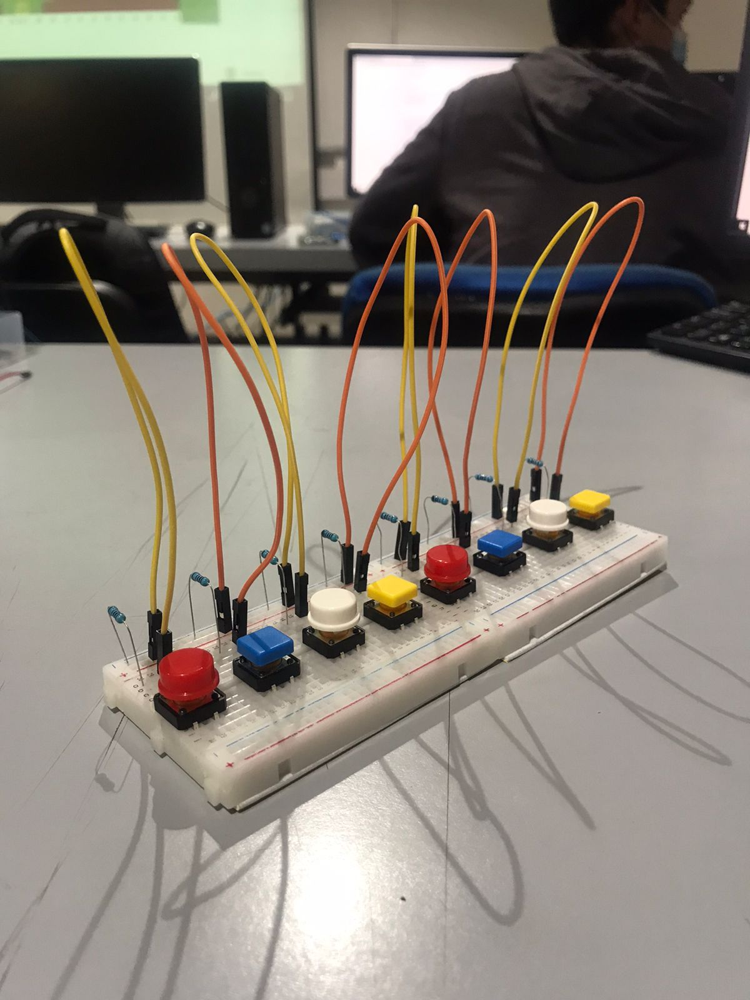

* 5to paso

Conectar el circuito de la protoboard con la fuente de alimentación que es el Arduino.
esto quiere decir que al canal positivo de la protoboard conectarlos con la salida de 5V del Arduino y que el canal negativo de la protoboard a una entrada de tierra en la placa de Arduino.

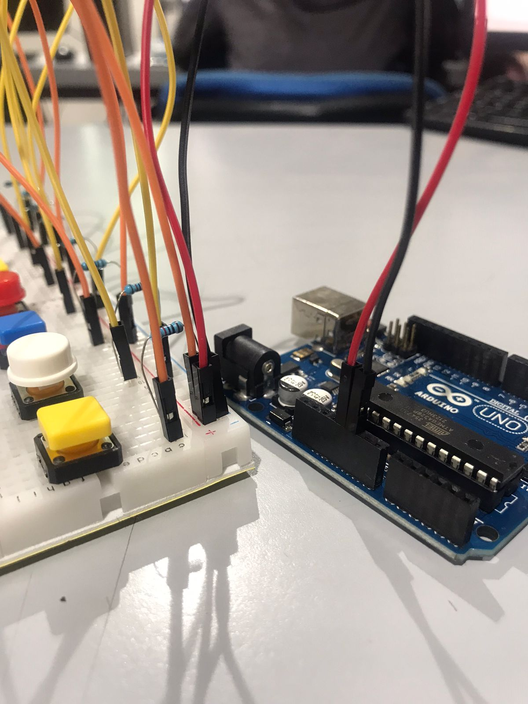

* 6to paso

Conectar el parlante a la protoboard, uno de los cables del parlante va a la salida de Arduino, la cual fue designada en el pin número 10.
mientras que el otro cable se introduce al canal negativo de la protoboard.

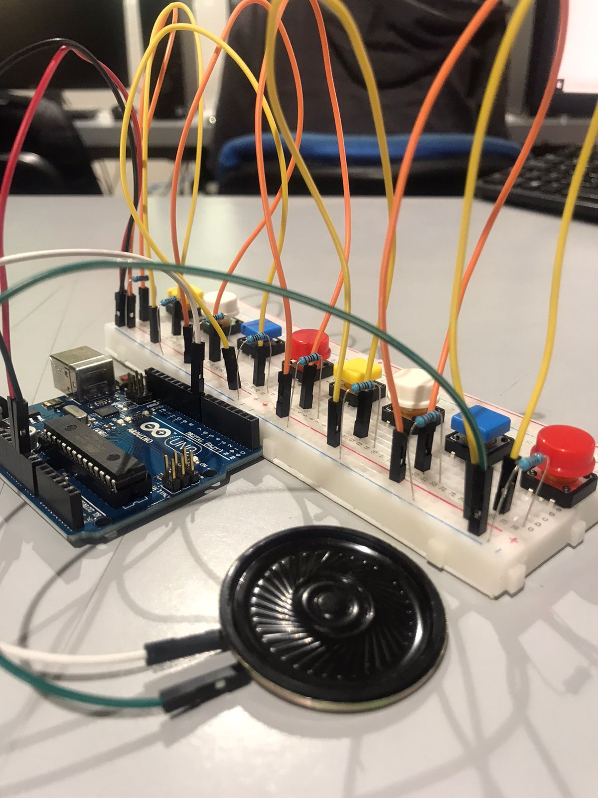

* 7mo paso

Colocar un cable entre la resistencia del canal negativo del botón y el botón. Este cable nos va a servir para enviar una señal al Arduino.

* 8vo paso

Colocar estos cables en sus pines correspondientes, esos pines son del 2 al 9, procura colocar los cables de señal en el orden correcto, los cuales van desde el botón de la izquierda conectado al pin2 hacia el botón de la derecha que va conectado en el pin9.
(imagen de referencia se logra ver un error al ocupar los pine 0 y 1que están explicados en la sección de código para el microcontrolador)

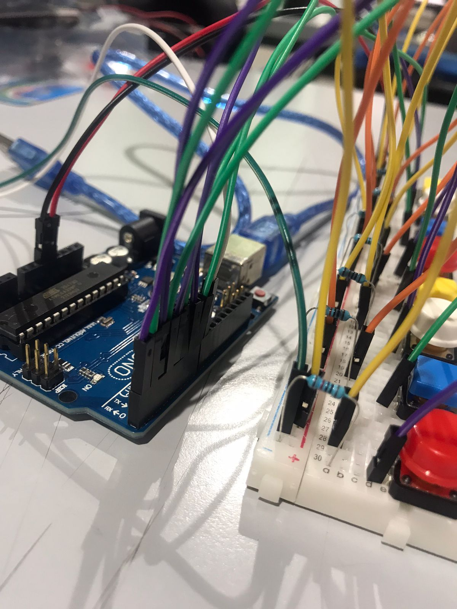

* 9no paso 

Colocar luces LED, estas luces LED se colocan desde el lado negativo del botón a una nueva línea dentro de la protoboard, ya que así mediante el hardware se logra presionar el botón y encender la luz, no olvidar conectar el canal negativo del led con una resistencia al canal negativo de la protoboard.

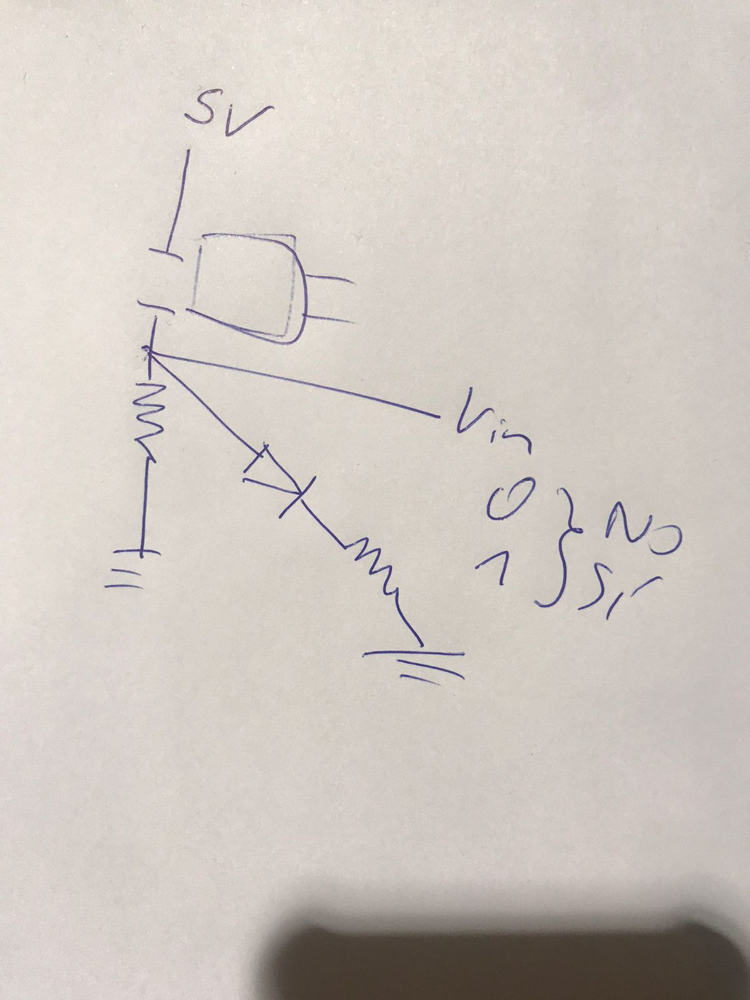
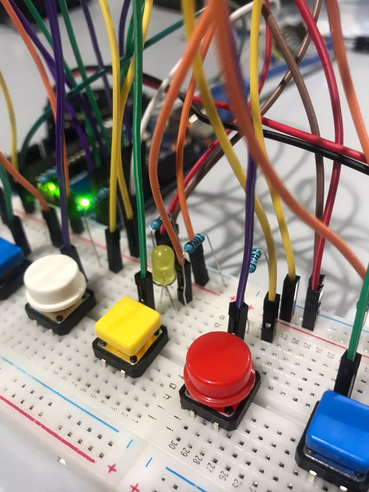
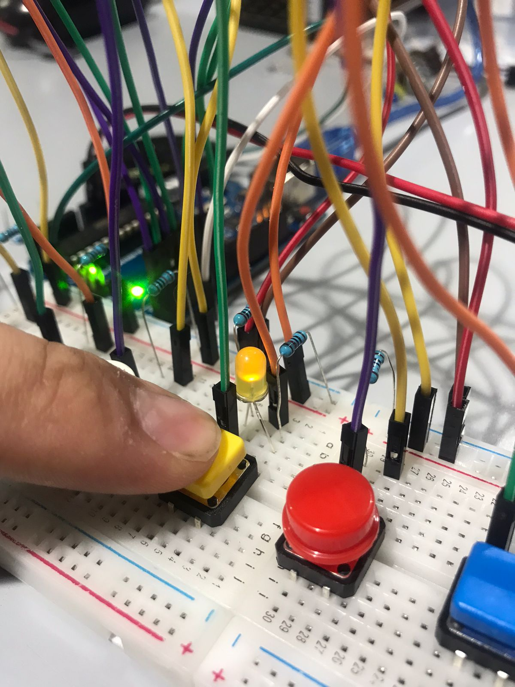

* 10mo Paso

Colocar potenciómetro, este potenciómetro tiene 3 pines de conexión, el de los extremos pueden ser positio o negativo y el pin del medio es el pin de lectura que va al Arduino en el pin A0
los pines positivos o negativos dependen de si la lectura va a ser en sentido de las manecillas del reloj o en contra de las manecillas del reloj, en nuestro caso tiene que ser en el sentido a las manecillas del reloj.

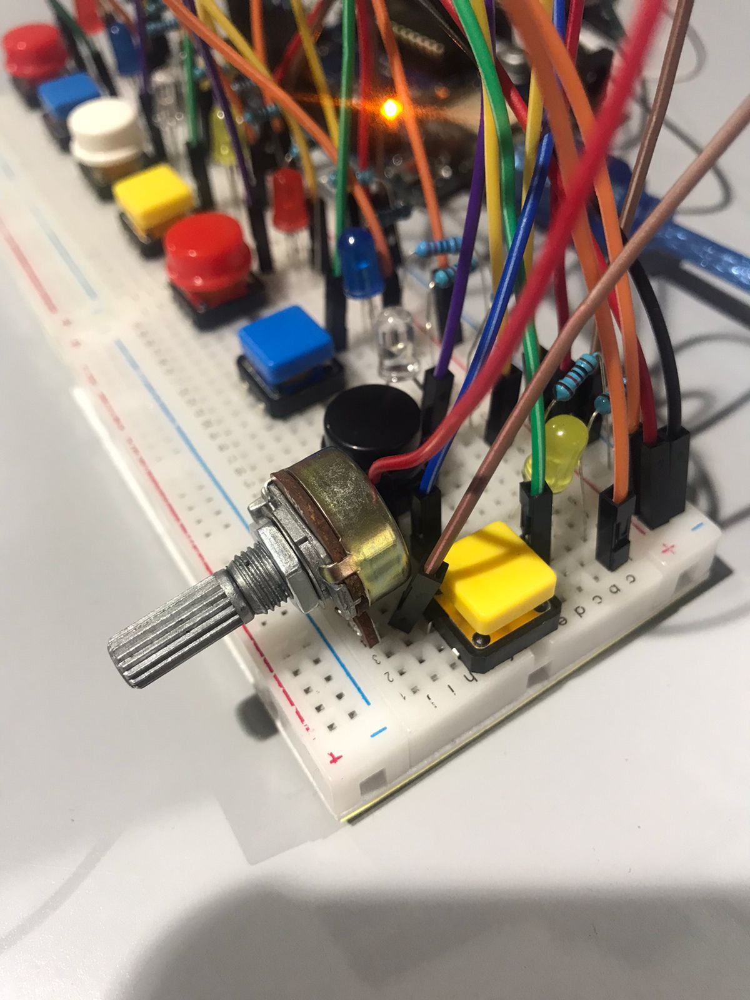

## conclusiones

Dentro de este proyecto surgieron distintas dificultades que mencionaremos a continuación

* Protoboard sin poder

Resulta que cuando construimos y unificamos las protoboard se nos olvido conectar los canales de poder y tierra de la protoboard 1 a la 2, nos dimos cuenta de esto porque al momento de darle poder a una luz LED esta no se encendía.

* Pin 0 y Pin1

Estos pines que son RX y TX generaban una interferencia en el funcionamiento del botón y la solución a esto fue correr dos espacios hacia arriba los pines, para usar desde el Pin2 y no desde el Pin0

* Luces LED

La luz LED, al colocarla antes del botón, se mantenía prendida y al momento de presionar el botón esta misma se apagaba, lo que buscamos como equipo era todo lo contrario, que al momento de presionar el botón se perdiera la luz, eso se consiguió solucionar invirtiendo el LED, colocando su lado positivo en la salida negativa del botón y llevando a tierra por otra línea de la protoboard, esto logro que la corriente pasara por el LED cuando se presione el botón.

* Potenciómetro y Delay

Sin el potenciómetro ocurre que el loop de Arduino al leer el botón presionado 1000 veces por segundo, repetía la nota 1000 veces por segundo y reventaba el parlante, al agregarle el potenciómetro que controlara un delay lograba hacer que la nota que se estaba presionando sonara por mas tiempo y evitara este reventón del parlante, y agregaba un tiempo de duración a la nota.

Muchas gracias por leer este post!:D

Saludos Freddy Briones y Tania Fuentes.

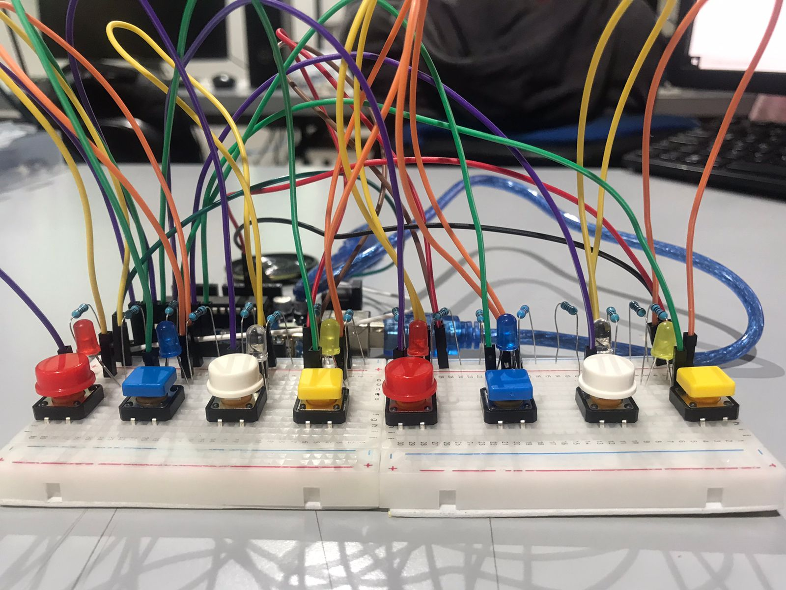

